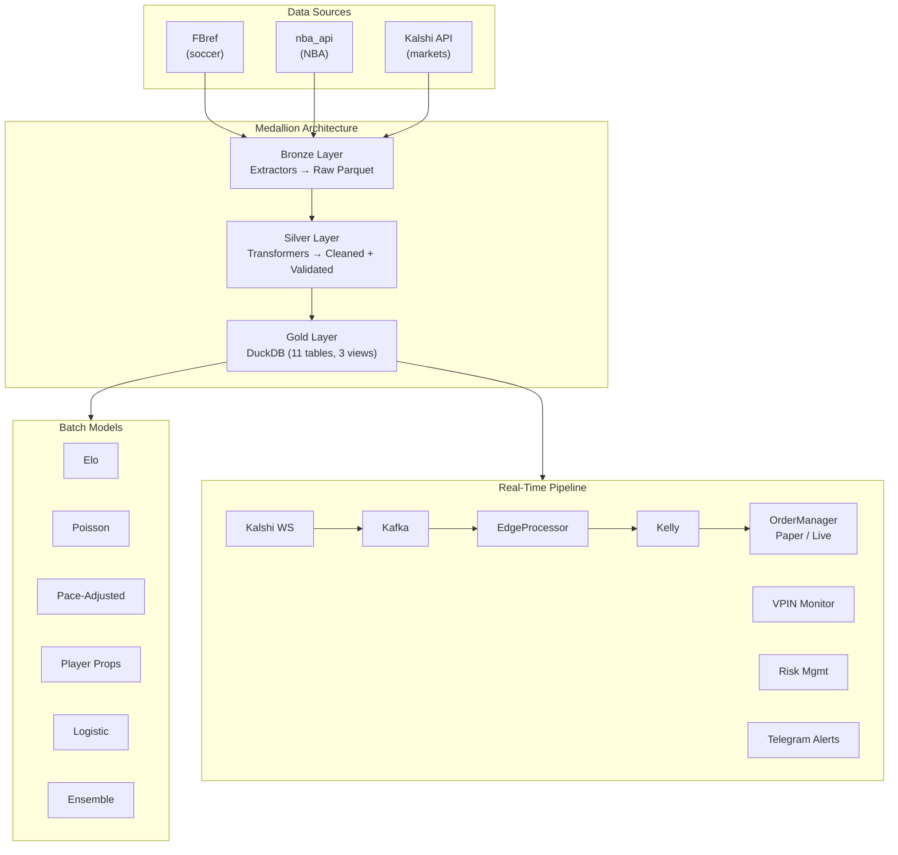

# Sports Prediction Markets

Edge detection and automated trading pipeline for sports prediction markets on Kalshi. Combines batch statistical modeling (Elo, Poisson, pace-adjusted, ensemble) with a real-time event-driven system that detects mispricings, sizes positions via Kelly criterion, and executes through a WebSocket/Kafka architecture.

## Architecture



## Quickstart

**Prerequisites:** Python 3.11+, [uv](https://docs.astral.sh/uv/), Docker (for Kafka/Airflow)

```bash
# Install dependencies
make install

# Initialize DuckDB schema (11 tables + views)
make init-db

# Run batch edge detection scan
make scan-edges

# Run backtest on historical edge signals
make backtest

# Start Kafka + Kafka UI
make kafka-up

# Start real-time pipeline (paper mode by default)
make run-rt

# Download Becker dataset and run historical backtest
make download-becker
make becker-backtest

# Start full Airflow stack
make airflow-up
# Airflow UI: http://localhost:8080 (admin/admin)
# Kafka UI:   http://localhost:8081
```

## Key Commands

| Command | Description |
|---------|-------------|
| `make install` | Install production dependencies via uv |
| `make install-dev` | Install with dev extras (pytest, ruff, mypy, jupyter) |
| `make test` | Run all tests with pytest |
| `make test-cov` | Run tests with HTML coverage report |
| `make lint` | Lint with ruff |
| `make format` | Auto-format with ruff |
| `make check` | Lint + test |
| `make init-db` | Create DuckDB schema |
| `make scan-edges` | Batch edge detection scan |
| `make backtest` | Backtest historical edges |
| `make run-rt` | Start real-time pipeline |
| `make kafka-up` | Start Kafka + Kafka UI |
| `make kafka-down` | Stop Kafka |
| `make airflow-up` | Start full Airflow + Postgres stack |
| `make airflow-down` | Stop Airflow |
| `make download-becker` | Download Becker prediction market dataset |
| `make becker-backtest` | Run backtest against Becker historical data |

## Project Structure

```
├── config/
│   └── settings.yaml           # All configuration defaults
├── dags/                       # Airflow DAGs
│   ├── sports_data_dag.py      # Daily FBref + NBA ingestion
│   ├── kalshi_markets_dag.py   # Hourly Kalshi market snapshots
│   ├── edge_detection_dag.py   # 2-hourly edge detection
│   └── maintenance_dag.py      # Weekly DuckDB maintenance
├── scripts/                    # CLI entrypoints
├── src/sports_pipeline/
│   ├── analytics/              # Probability models (Elo, Poisson, ensemble, etc.)
│   ├── backtesting/            # Simulator, replayer, calibration analysis
│   ├── edge_detection/         # Batch edge detector, filters, Kelly
│   ├── extractors/             # FBref, NBA, Kalshi data extractors
│   ├── loaders/                # DuckDB loader, schema, Becker views
│   ├── models/                 # Pydantic/Pandera schemas (bronze/silver/gold)
│   ├── quality/                # Data quality checks
│   ├── realtime/               # Event-driven trading system
│   │   ├── alerts/             # Telegram bot
│   │   ├── execution/          # Order manager, Kalshi REST client
│   │   ├── kafka/              # Producer, consumer, topic configs
│   │   ├── logging/            # Trade logger with DuckDB flush
│   │   ├── processors/         # Edge, VPIN, entropy, market maker, Bayesian
│   │   ├── risk/               # Risk manager, 3-layer kill switch
│   │   ├── sizing/             # Empirical Kelly, fee model
│   │   └── websocket/          # Kalshi WS client, auth, orderbook sync
│   ├── storage/                # Parquet store, path helpers
│   ├── transformers/           # Bronze → silver transformers
│   └── utils/                  # Logging, rate limiting, retry
├── tests/                      # 258 passing tests
├── docker-compose.yml          # Kafka, PostgreSQL, Airflow, Kafka UI
├── Makefile                    # All commands
└── pyproject.toml              # Dependencies and tool config
```

## Documentation

| Document | Description |
|----------|-------------|
| [Architecture](docs/architecture.md) | System design, medallion layers, DuckDB schema, Kafka topics |
| [Models](docs/models.md) | Probability models, Elo math, Poisson, calibration, edge detection |
| [Real-Time System](docs/realtime.md) | WebSocket, Kafka, EdgeProcessor, VPIN, risk management |
| [Backtesting](docs/backtesting.md) | Running backtests, Becker dataset, calibration analysis |
| [Configuration](docs/configuration.md) | Every config knob, defaults, environment variables |
| [Development](docs/development.md) | Dev setup, testing, linting, adding new models |

## Tech Stack

- **Python 3.11+** with **uv** for dependency management
- **DuckDB** — analytical database (gold layer, parquet queries)
- **Apache Kafka** — event streaming between real-time components
- **Apache Airflow** — DAG orchestration for batch pipelines
- **Pydantic** — configuration and schema validation
- **Pandera** — DataFrame schema enforcement
- **scikit-learn / scipy** — statistical modeling and calibration
- **websockets + aiohttp + aiokafka** — async real-time stack
- **structlog** — structured JSON logging
- **Docker Compose** — Kafka, PostgreSQL, Airflow, Kafka UI
