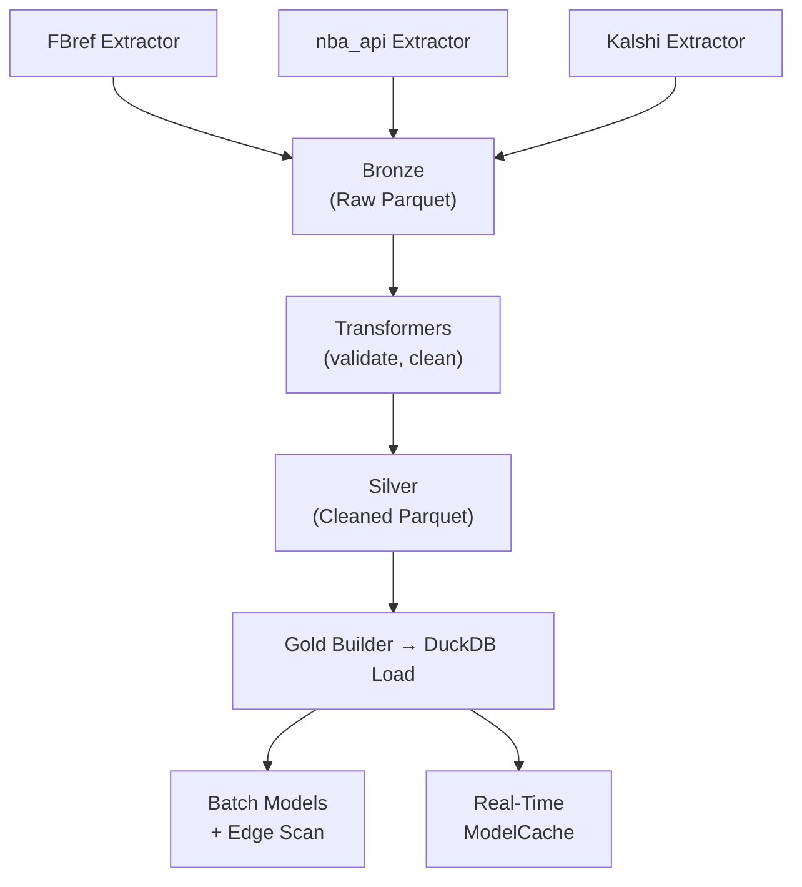
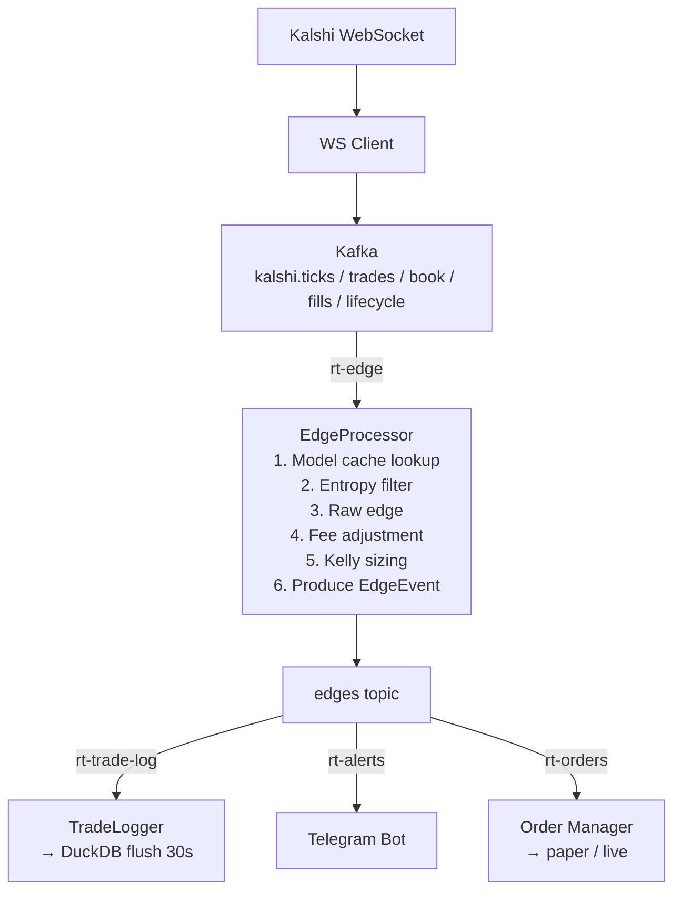

# Architecture

System design overview for the sports prediction markets pipeline.

## Medallion Architecture

Data flows through three layers, each stored as Parquet files on disk with DuckDB as the analytical query layer.

```
Bronze (raw)  →  Silver (cleaned)  →  Gold (DuckDB)
```

### Bronze Layer (`data/bronze/`)

Raw data extracted from external APIs, stored as-is in Parquet. One file per extraction run, organized by sport and data type.

- **FBref**: match results, player stats, team stats for 5 European soccer leagues
- **nba_api**: game logs, player stats, team stats for NBA
- **Kalshi**: market snapshots, prices, metadata

### Silver Layer (`data/silver/`)

Cleaned, validated, and deduplicated data. Transformers apply:
- Schema validation via Pandera
- Name normalization (team/player name standardization)
- Deduplication across extraction runs
- Entity matching between Kalshi markets and sports entities

### Gold Layer (`data/gold/sports_analytics.duckdb`)

DuckDB database with 11 tables and 3 views that power both batch analysis and real-time model loading.

## Data Flow



## Real-Time Pipeline

The real-time system is an async Python application that connects all components via Kafka.



**Consumer groups:**
- `rt-edge` — consumes `kalshi.ticks`, runs EdgeProcessor, produces to `edges`
- `rt-trade-log` — consumes `edges`, buffers and flushes to DuckDB every 30s
- `rt-alerts` — consumes `edges`, sends Telegram alerts for non-rejected high-confidence edges
- `rt-orders` — consumes `edges`, converts to OrderRequestEvent, routes to OrderManager

**Background loops:**
- Market discovery (default every 5 min) — discovers active sports markets, updates WS subscriptions
- Model cache refresh (default every 5 min) — reloads model probabilities from DuckDB
- Trade log flush (every 30s) — writes buffered EdgeEvents to `gold.trade_log`

## DuckDB Schema

### Tables (11)

| Table | Description |
|-------|-------------|
| `gold.soccer_matches` | Match results with xG data |
| `gold.soccer_player_matches` | Per-player match stats (goals, assists, xG, etc.) |
| `gold.nba_games` | NBA game results |
| `gold.nba_player_games` | Per-player game stats (points, rebounds, assists, etc.) |
| `gold.kalshi_market_snapshots` | Point-in-time market price snapshots |
| `gold.edge_signals` | Detected edges with model prob, market prob, Kelly, outcome |
| `gold.model_performance` | Per-model Brier score, log loss, hit rate, ROI |
| `gold.elo_ratings` | Current Elo ratings per team |
| `gold.trade_log` | Real-time edge evaluations (traded + rejected) |
| `gold.rt_positions` | Real-time position tracking per market |
| `gold.rt_orders` | Real-time order tracking |

### Views (3)

| View | Description |
|------|-------------|
| `gold.v_active_edges` | Unresolved edges with \|edge\| >= 5% |
| `gold.v_model_leaderboard` | Model ranking by avg Brier, hit rate, ROI |
| `gold.v_edge_pnl` | Resolved edge P&L grouped by sport, model |

### Becker Dataset Views (3)

Created dynamically over raw Parquet files (no data copy):

| View | Description |
|------|-------------|
| `gold.becker_trades` | All sports trades from Becker dataset |
| `gold.becker_markets` | All sports markets from Becker dataset |
| `gold.becker_settled` | Settled markets with known yes/no outcomes |

## Kafka Topics

9 topics with configured retention policies:

| Topic | Retention | Description |
|-------|-----------|-------------|
| `kalshi.ticks` | 24h | Price updates from WebSocket |
| `kalshi.trades` | 7d | Trade executions |
| `kalshi.book` | 1h | Order book snapshots |
| `kalshi.fills` | 30d | Our order fills |
| `kalshi.lifecycle` | 7d | Market open/close/settle events |
| `edges` | 30d | Detected edge events (traded + rejected) |
| `orders` | 30d | Order request events |
| `risk` | 30d | Risk alerts |
| `system` | 1d | System health events |

## Airflow DAGs

4 DAGs orchestrate the batch pipeline:

| DAG | Schedule | Tasks |
|-----|----------|-------|
| `sports_data_dag` | Daily 06:00 UTC | Extract FBref matches/players/teams, NBA games/players/teams, transform, load to DuckDB |
| `kalshi_markets_dag` | Hourly | Snapshot Kalshi sports markets, transform, load, match entities |
| `edge_detection_dag` | Every 2 hours | Build Elo ratings, run Poisson model, scan edges, evaluate performance |
| `maintenance_dag` | Weekly Sunday 04:00 UTC | Refresh DuckDB views, vacuum/analyze, export model performance |

## Directory Structure

```
src/sports_pipeline/
├── analytics/          # Probability models
│   ├── base.py         # BaseProbabilityModel ABC
│   ├── elo.py          # Elo rating system
│   ├── poisson.py      # Poisson goal model (soccer)
│   ├── pace_adjusted.py# Pace-adjusted efficiency (NBA)
│   ├── player_props.py # Player prop distributions
│   ├── logistic.py     # Logistic regression model
│   ├── ensemble.py     # Weighted ensemble
│   └── calibration.py  # Brier, log loss, isotonic calibration
├── backtesting/
│   ├── simulator.py    # BacktestSimulator (historical edge P&L)
│   ├── replayer.py     # TradeStreamReplayer (Becker dataset replay)
│   ├── calibration.py  # edge_calibration, model_uncertainty, optimal_thresholds, vpin_effectiveness
│   ├── metrics.py      # Sharpe, drawdown, profit factor, hit rate
│   └── reports.py      # Report generation
├── edge_detection/
│   ├── detector.py     # Batch edge detector
│   ├── filters.py      # Volume, time, confidence filters
│   ├── kelly.py        # Standard Kelly criterion
│   └── alerts.py       # Slack/webhook alerts
├── extractors/
│   ├── fbref/          # FBref scraper (matches, players, teams)
│   ├── nba/            # nba_api wrapper (games, players, teams)
│   └── kalshi/         # Kalshi REST API client
├── loaders/
│   ├── duckdb_loader.py# DuckDB connection management
│   ├── views.py        # Schema DDL (11 tables, 3 views)
│   ├── becker_views.py # Views over Becker parquet files
│   └── gold_builder.py # Silver → gold loading
├── models/             # Pydantic/Pandera schemas per layer
│   ├── bronze/         # Raw data schemas
│   ├── silver/         # Cleaned data schemas
│   └── gold/           # Analytical schemas
├── realtime/
│   ├── app.py          # Main orchestrator (wires all components)
│   ├── config.py       # RealtimeConfig and sub-configs
│   ├── events.py       # 9 event types (Tick, Trade, Edge, Order, etc.)
│   ├── discovery.py    # MarketDiscoveryService
│   ├── model_loader.py # ModelCacheLoader (DuckDB → ModelCache)
│   ├── alerts/         # TelegramBot
│   ├── execution/      # OrderManager, AsyncKalshiClient
│   ├── kafka/          # Producer, Consumer, TopicConfig
│   ├── logging/        # TradeLogger (buffer → DuckDB)
│   ├── processors/     # EdgeProcessor, VPINCalculator, EntropyFilter, AvellanedaStoikov, BayesianUpdater, SpreadMonitor
│   ├── risk/           # RiskManager, KillSwitch (3-layer)
│   ├── sizing/         # empirical_kelly, fee_model
│   └── websocket/      # KalshiWebSocketClient, auth, orderbook sync
├── storage/            # Parquet I/O, path helpers
├── transformers/       # Bronze → silver (soccer, NBA, Kalshi)
└── utils/              # Logging, rate limiting, retry
```

See also: [Models](models.md) | [Real-Time System](realtime.md) | [Configuration](configuration.md)
