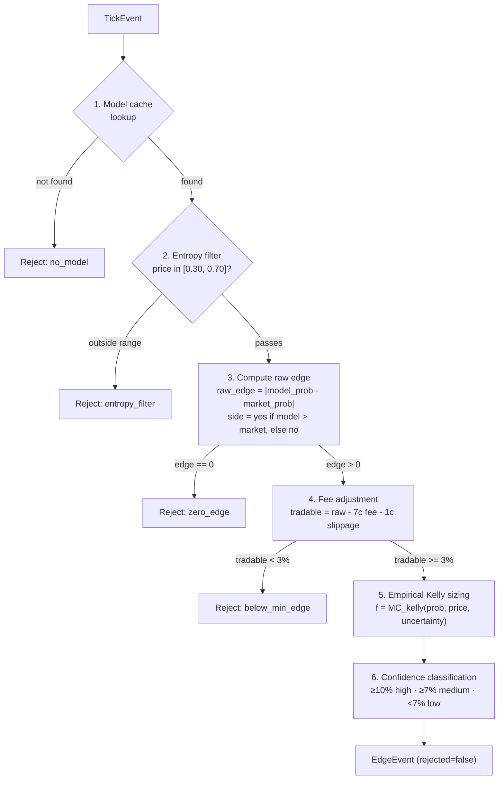

# Real-Time System

Deep-dive into the event-driven edge detection and trading pipeline.

## Overview

The real-time system (`realtime/app.py`) is a single async Python process that wires together:

1. **Market Discovery** — finds active Kalshi sports markets
2. **WebSocket Client** — streams live prices, trades, orderbook deltas, fills, lifecycle events
3. **Kafka Layer** — event bus connecting all processors
4. **EdgeProcessor** — detects mispricings in real-time
5. **Trade Logger** — buffers edge events to DuckDB
6. **Telegram Bot** — alerts on high-confidence edges
7. **Order Manager** — executes trades (paper or live)

Start with:

```bash
make run-rt
```

Paper mode is enabled by default (`realtime.paper_mode: true`).

## Startup Sequence

1. Load settings from `config/settings.yaml` + env overlay
2. Create Kafka topics if they don't exist (9 topics)
3. Initialize shared state: `ModelCache`, discovered markets list
4. Start Kafka producer
5. Start Kalshi REST client
6. Create core processors: EdgeProcessor, TradeLogger, TelegramBot, OrderManager
7. Create MarketDiscoveryService and ModelCacheLoader
8. Create WebSocket client (initially empty subscription list)
9. Wire handler functions for each consumer group
10. Start 4 Kafka consumers (rt-edge, rt-trade-log, rt-alerts, rt-orders)
11. Launch 8 async tasks (WS client + 4 consumers + 3 background loops)
12. Wait for SIGINT/SIGTERM
13. Graceful shutdown: cancel tasks, final flush, cleanup connections

## WebSocket Client

**File:** `realtime/websocket/client.py`

Connects to `wss://api.elections.kalshi.com/trade-api/ws/v2`.

### Authentication

**File:** `realtime/websocket/auth.py`

Uses RSA key-based auth:
1. Load private key from `KALSHI_PRIVATE_KEY_PATH`
2. Sign timestamp with RSA-PSS (SHA-256)
3. Send auth message with API key ID + signature

### Channels

Subscribes to 5 channels per market ticker:

| Channel | Kafka Topic | Event Type |
|---------|-------------|------------|
| `ticker` | `kalshi.ticks` | TickEvent |
| `trade` | `kalshi.trades` | TradeEvent |
| `orderbook_delta` | `kalshi.book` | BookSnapshotEvent |
| `fill` | `kalshi.fills` | FillEvent |
| `market_lifecycle_v2` | `kalshi.lifecycle` | LifecycleEvent |

### Reconnection

Exponential backoff on disconnect:
- Initial delay: 1.0s
- Max delay: 60.0s
- Ping interval: 10.0s

Subscriptions are dynamically updated via `update_subscriptions(tickers)` when market discovery finds new markets.

## Kafka Layer

### Topics

9 topics with configured retention:

| Topic | Retention | Partitions |
|-------|-----------|------------|
| `kalshi.ticks` | 24h | 1 |
| `kalshi.trades` | 7d | 1 |
| `kalshi.book` | 1h | 1 |
| `kalshi.fills` | 30d | 1 |
| `kalshi.lifecycle` | 7d | 1 |
| `edges` | 30d | 1 |
| `orders` | 30d | 1 |
| `risk` | 30d | 1 |
| `system` | 1d | 1 |

### Producer

**File:** `realtime/kafka/producer.py`

Wraps `aiokafka.AIOKafkaProducer`. Sends events as JSON-serialized bytes, keyed by ticker for ordering guarantees.

### Consumer

**File:** `realtime/kafka/consumer.py`

Wraps `aiokafka.AIOKafkaConsumer`. Each consumer group has a dedicated handler function.

## Event Types

**File:** `realtime/events.py`

All events extend `BaseEvent` (Pydantic model) with `event_type` and `timestamp`. Serialized to/from JSON for Kafka transport.

| Event | Fields |
|-------|--------|
| `TickEvent` | ticker, yes_price, no_price, yes_bid, yes_ask, volume, open_interest |
| `TradeEvent` | ticker, price, count, taker_side, trade_id |
| `BookSnapshotEvent` | ticker, yes_bids, yes_asks, seq |
| `FillEvent` | order_id, ticker, side, action, price, count, remaining_count |
| `LifecycleEvent` | ticker, status (open/closed/settled), result |
| `EdgeEvent` | ticker, model_prob, market_prob, raw_edge, tradable_edge, kelly_fraction, suggested_side, confidence, rejected, reject_reason |
| `OrderRequestEvent` | ticker, side (yes/no), action (buy/sell), price, count, expiration_ts, source |
| `RiskAlertEvent` | level (normal/elevated/critical/emergency), reason, ticker, action |
| `SystemEvent` | action (startup/shutdown/health), detail |

## EdgeProcessor Pipeline

**File:** `realtime/processors/edge_processor.py`

For each `TickEvent`:



Every evaluation produces an `EdgeEvent`. Rejected edges carry `reject_reason` for debugging.

### Model Cache

`ModelCache` bridges batch models to real-time. Loads model probabilities from DuckDB, caches in memory, refreshes every `model_cache_refresh_seconds` (default 300s).

Each entry stores: ticker, model_prob, model_uncertainty (ensemble std dev), model_name.

## VPIN Calculator

**File:** `realtime/processors/vpin.py`

Volume-Synchronized Probability of Informed Trading.

### Mechanics

1. Trades arrive and are classified as buy/sell (explicit taker_side or tick rule)
2. Volume accumulates into fixed-size buckets (`bucket_size=50` contracts)
3. When a bucket fills, record `|buy_vol - sell_vol|`
4. VPIN = sum of imbalances / sum of volumes over rolling `n_buckets` (50) window
5. Requires all `n_buckets` filled before producing a value

### Per-Market Tracking

`VPINManager` maintains a `VPINCalculator` per ticker. New calculators are created on first trade, removed when markets settle.

### Thresholds

| VPIN Value | Level | Response |
|-----------|-------|----------|
| < 0.30 | Normal | No action |
| >= 0.30 | Elevated | Widen market maker spreads |
| >= 0.60 | Critical | Kill switch Layer 2 (cancel all) |

## Market Maker

**File:** `realtime/processors/market_maker.py`

Avellaneda-Stoikov model adapted for binary prediction markets.

### Log-Odds Transformation

Maps probabilities [0,1] to real line via logit:

```
logit(p) = ln(p / (1-p))
inv_logit(x) = 1 / (1 + exp(-x))
```

### Reservation Price

```
r = s - q·γ·σ²·τ
```

- `s` = mid price in log-odds space
- `q` = inventory (positive = long YES)
- `γ` = risk aversion (0.1)
- `σ` = volatility in log-odds space (estimated from recent price history)
- `τ` = time to expiry (normalized)

### Optimal Spread

```
δ = γ·σ²·τ + (2/γ)·ln(1 + γ/κ)
```

- `κ` = order arrival intensity (1.5)

### Quoting

1. Compute reservation price and spread in log-odds space
2. Convert back to probability: `bid = inv_logit(r - δ/2)`, `ask = inv_logit(r + δ/2)`
3. Enforce minimum spread (2 cents)
4. Clip to [0.01, 0.99]
5. Position-dependent sizing: reduce bid size when long, reduce ask size when short

Disabled by default (`market_maker.enabled: false`).

## Risk Management

### Risk Manager

**File:** `realtime/risk/risk_manager.py`

Tracks positions and P&L, emits `RiskAlertEvent` when thresholds are breached.

| Check | Threshold | Action |
|-------|-----------|--------|
| Position per market | > 100 contracts | `cancel_ticker` (ELEVATED) |
| Total exposure | > $5,000 | `cancel_all` (CRITICAL) |
| Daily loss | > $500 | `cancel_all` (CRITICAL) |
| Emergency loss | > $1,000 | `shutdown` (EMERGENCY) |

### Kill Switch (3-Layer)

**File:** `realtime/risk/kill_switch.py`

| Layer | Trigger | Action | Notes |
|-------|---------|--------|-------|
| L1 (Passive) | System crash | Auto-cancel | All orders use GTD with 10-min expiry. No code needed — exchange handles it. |
| L2 (Active) | VPIN critical, position limit, repeated errors (5+) | Cancel all open orders | Recoverable — can be reset |
| L3 (Emergency) | Daily loss > emergency limit, WS disconnect | Full shutdown | Requires manual restart |

States: `ACTIVE` → `TRIGGERED_L2` → `TRIGGERED_L3`

## Order Execution

### Edge to Order Conversion

In `app.py`, non-rejected EdgeEvents are converted to `OrderRequestEvent`:

```python
price_cents = yes_price if side=="yes" else (1 - yes_price)  # in cents
count = floor(kelly_fraction × bankroll / price_cents)
```

### Order Manager

**File:** `realtime/execution/order_manager.py`

Routes orders based on mode:
- **Paper mode** — logs the order, tracks simulated position
- **Live mode** — sends to Kalshi REST API via `AsyncKalshiClient`

All orders use Good-Til-Date (GTD) expiry of `gtd_expiry_minutes` (default 10 min) — this is Kill Switch Layer 1.

### Position Tracking

Positions are tracked in `gold.rt_positions` (DuckDB) and in-memory during the session. On fills, the Risk Manager is updated.

## Alerts

### Telegram Bot

**File:** `realtime/alerts/telegram_bot.py`

Sends formatted messages for high-confidence, non-rejected edges. Disabled by default (`telegram.enabled: false`).

Required env vars when enabled:
- `TELEGRAM_BOT_TOKEN`
- `TELEGRAM_CHAT_ID`

## Trade Logging

### Buffer and Flush

`TradeLogger` buffers `EdgeEvent` objects in memory. Every 30 seconds, the flush loop writes them to `gold.trade_log` in DuckDB.

On shutdown, a final flush ensures no data is lost.

The `gold.trade_log` table records both traded and rejected edges for analysis.

## Market Discovery

**File:** `realtime/discovery.py`

`MarketDiscoveryService` periodically (default every 5 min):
1. Queries Kalshi REST API for active markets in target series (KXNBA, KXNFL, KXMLB, KXNHL, KXSOCCER, KXMMA)
2. Filters to markets passing the entropy filter (price in [0.30, 0.70])
3. Returns list of `DiscoveredMarket` objects
4. Updates WebSocket subscriptions with new tickers
5. Triggers model cache reload from DuckDB

See also: [Architecture](architecture.md) | [Models](models.md) | [Configuration](configuration.md)
